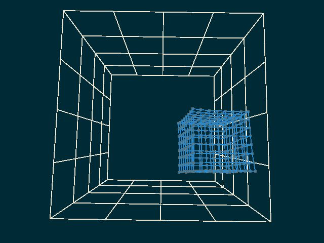

# Softbody-Simulation

================

Default key and mouse setup as provided by input.cpp:

    ESC: exit application
    v: switch wireframe/triangle mode
    s: display structural springs on/off
    h: display shear springs on/off
    b: display bend springs on/off
    space: save the current screen to a file, filename index increments automatically
    p: pause on/off
    z: camera zoom in
    x: camera zoom out
    right mouse button + move mouse: camera control
    e: reset camera to default position

Features Implemented:

- Spring (all three kinds of sprins)
- Bounding box collision
- Forcefield
- Use mouse to drag the whole jello
- Inclined plane collision
- Customized environment for aesthetic reason

Please note that due to nature of this algorithm, the jello might not be able to recover after collision.

The recorded pictures are based on jello_self_defined.w in world directory.

In this customized world file includes
- plane: x + y + 2z -5 = 0
- forcefield: constant force field with -0.003 0.000 -0.001
- other parameters are left as default

Thank you!
